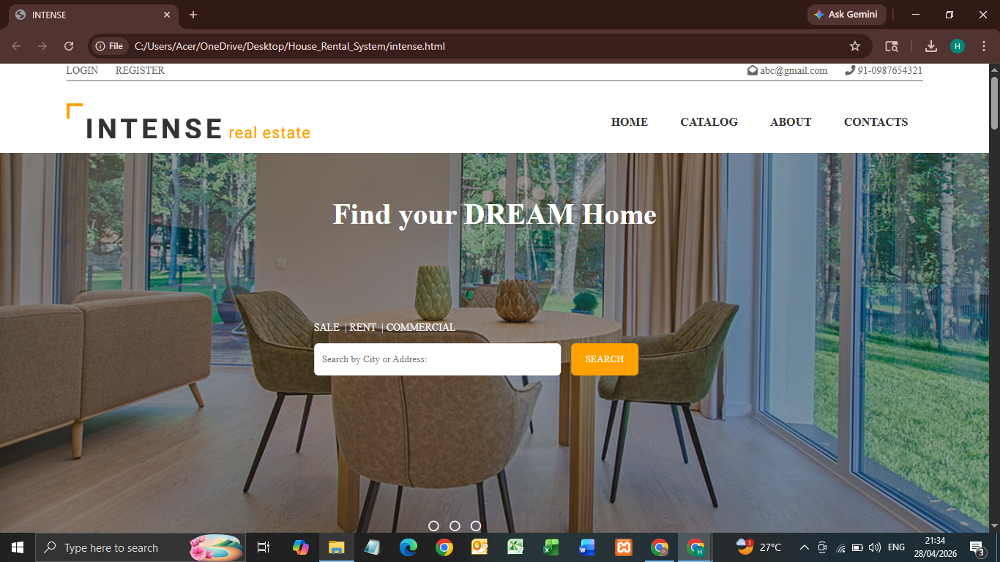
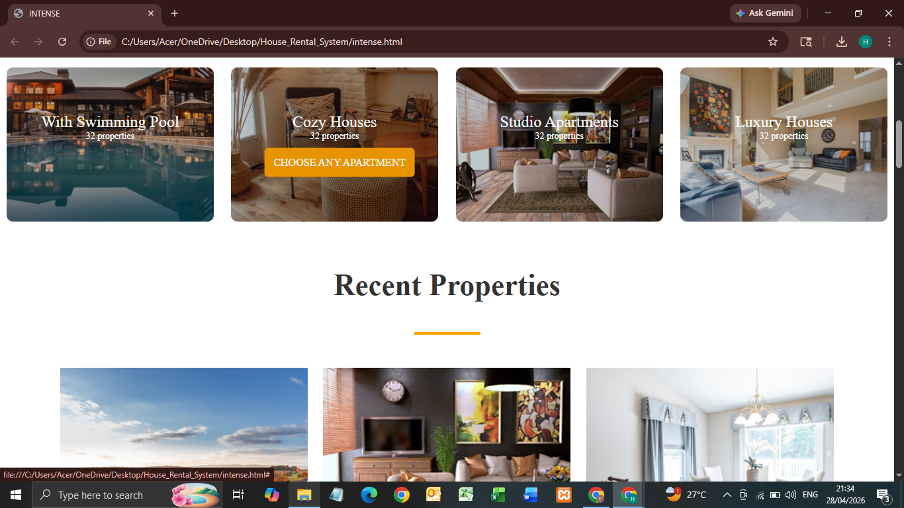
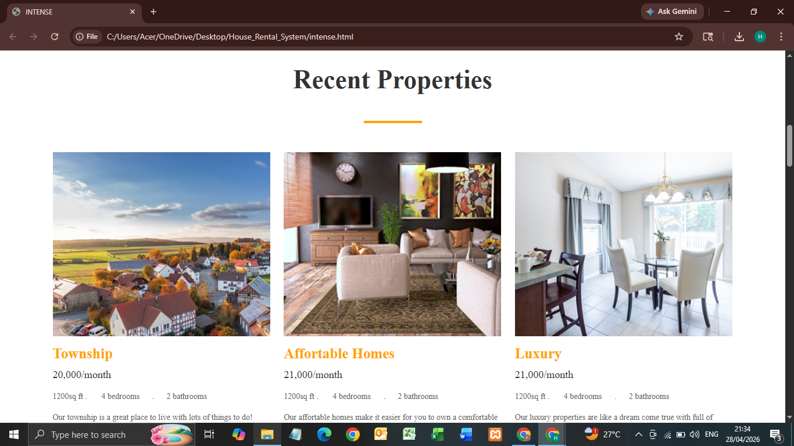
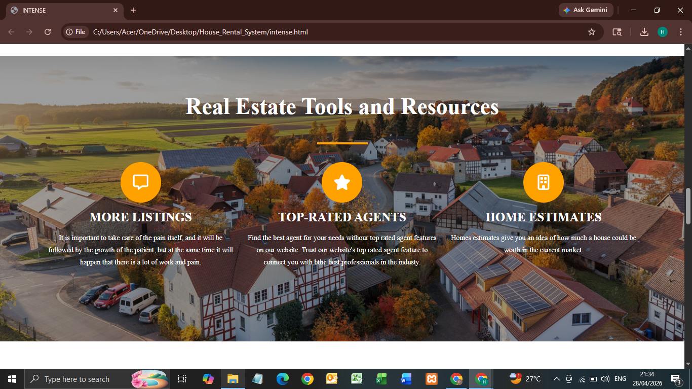
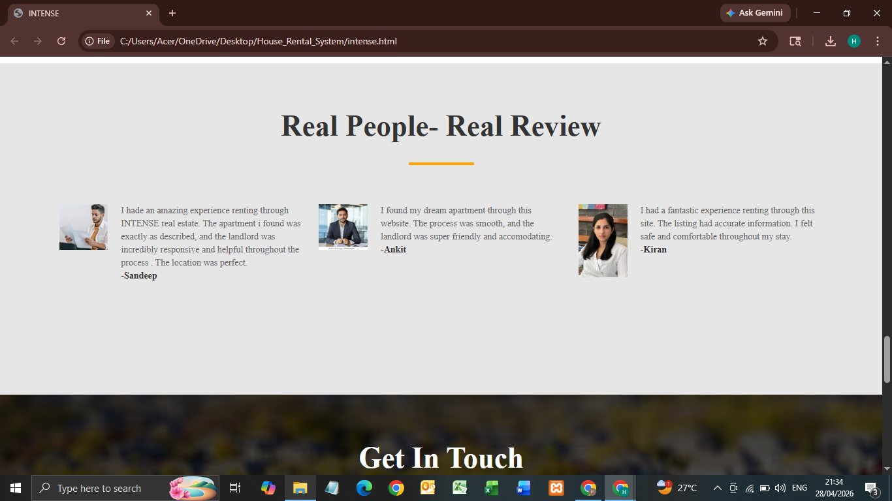
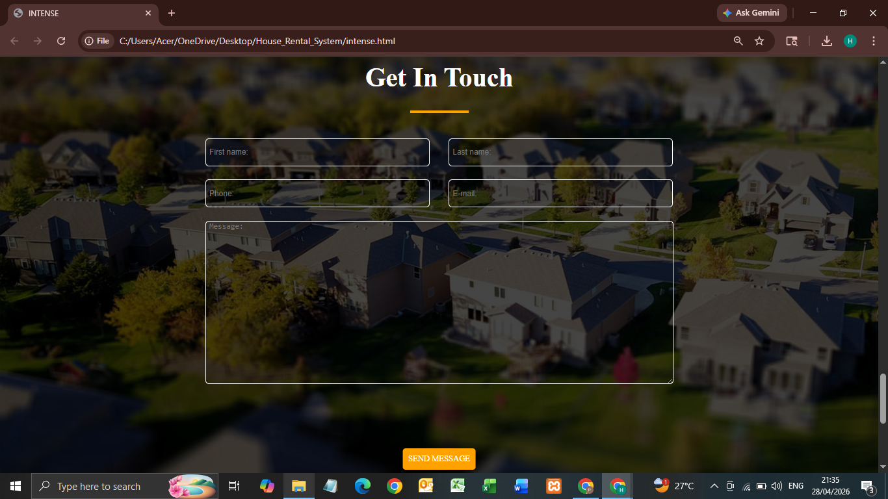
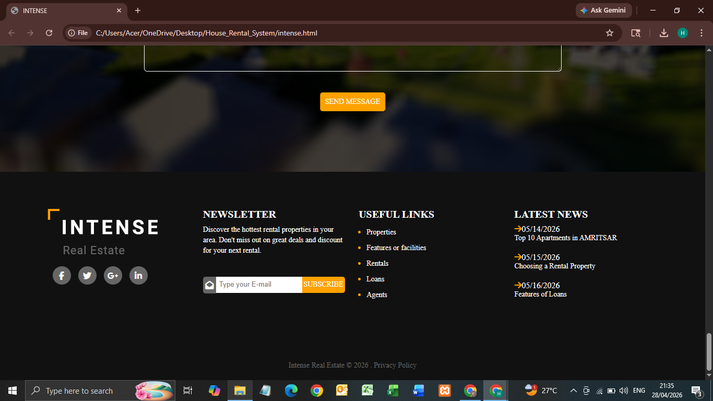
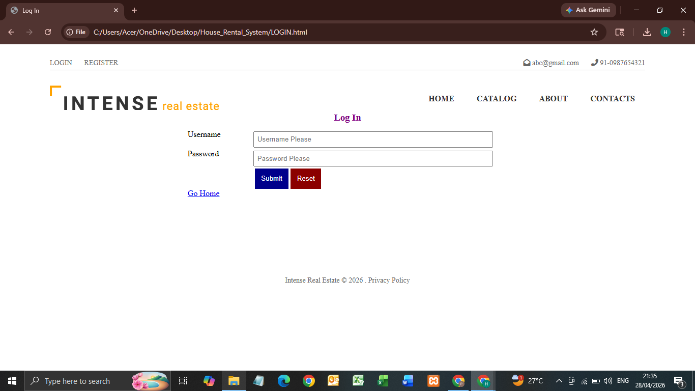
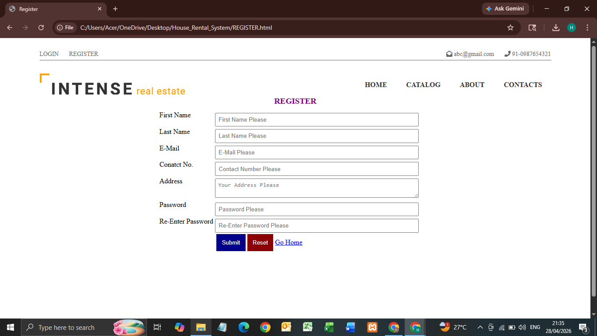
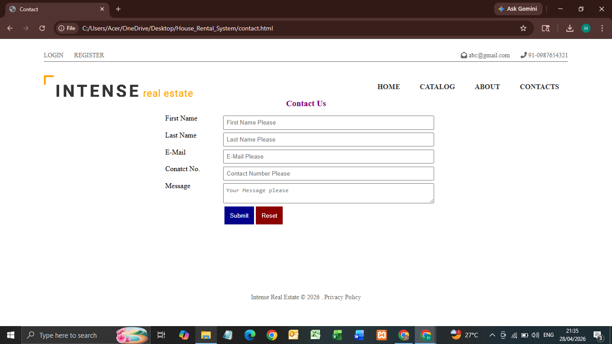

# house-rental-system
# 🏠 House Rental System

## 📌 Project Overview
The House Rental System is a static web-based project developed using HTML and CSS. It is designed to showcase a user-friendly interface for browsing rental properties, viewing details, and contacting property owners.

This project focuses on front-end design and layout to simulate a real-world house rental website.

---

## 🎯 Objectives
- To design a responsive and user-friendly website
- To display property listings in an organized manner
- To practice front-end development using HTML and CSS
- To simulate a real estate rental platform interface

---

## 🚀 Features
- 🏠 Home Page with navigation menu
- 🔍 Property search bar (UI only)
- 🏘️ Property listings section
- 📄 Property details display
- 👨‍💼 Real estate agent section
- ⭐ Review/Feedback section
- 📞 Contact / Get in Touch form (UI only)
- 🔐 Login & Registration pages (UI only)

---

## 🛠️ Technologies Used
- HTML
- CSS

---

---

## 🖥️ How to Run the Project

1. Download or clone the repository
2. Open the project folder
3. Double-click on `index.html`

OR

Open in browser:
file:///path-to-project/index.html

---
## 📸 Screenshots

### 🏠 Home Page

  
  
  
  

  
  
  
  

---

### 🔐 Login Page

  

---

### 📝 Register Page

  

---

### 📞 Contact Page

  

## 📈 Future Improvements
- Add backend functionality (PHP & MySQL)
- Implement real search and filter system
- Add login authentication system
- Make the website fully responsive

---

## 👨‍💻 Author
**Prince Kumar**  

---

## 🙏 Thank You
